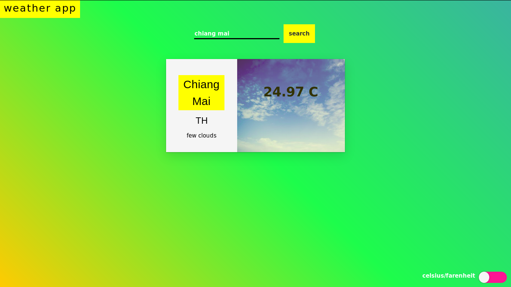

[![Contributors][contributors-shield]][contributors-url]
[![Forks][forks-shield]][forks-url]
[![Stargazers][stars-shield]][stars-url]
[![Issues][issues-shield]][issues-url]
[![MIT License][license-shield]][license-url]

# Weather APP (js project)
 

  

  <h3 align="center">
    A project from the Microverse Javascript Curriculum
  </h3>

  <h3 align="center">
	 Live Version link - https://alexawesomecode.github.io/project-weather-app
  </h3>

  

 A Weather App Project for Microverse. Its also part of the Odin project curriculum.</a>
     

  

## Project 'Weather App'

A project app built with Javascipt. You can look for cities and get the weather. You can also toggle between Celcius and Farenheit.

## Snapshot

# Validations

-ESLINT

# Get Started

Download or clone this [repo here](https://github.com/alexawesomecode/project-weather-app) and open the 'index.html. file.

# Built With

This project was built with these techologies:

* JAVASCRIPT
* HTML
* CSS3

# Authors

**Alejandro Andres**

- Github: [@alexawesomecode](https://github.com/alexawesomecode)
- Twitter: [@alexcode0](https://twitter.com/alexcode0)
- Linkedin: [Alejandro Andres](https://www.linkedin.com/in/alejandro-andres-126592191/)

# License

This project is licensed under the MIT License - see the [LICENSE.md](LICENSE.md) file for details

<!-- ACKNOWLEDGEMENTS -->
## Acknowledgements
* [Microverse](https://www.microverse.org/)
* [The Odin Project](https://www.theodinproject.com/)

<!-- MARKDOWN LINKS & IMAGES -->
<!-- https://www.markdownguide.org/basic-syntax/#reference-style-links -->
[contributors-shield]: https://img.shields.io/github/contributors/alexawesomecode/project-weather-app.svg?style=flat-square
[contributors-url]: https://github.com/alexawesomecode/project-weather-app/graphs/contributors
[forks-shield]: https://img.shields.io/github/forks/alexawesomecode/project-weather-app
[forks-url]: https://github.com/alexawesomecode/project-weather-app/network/members
[stars-shield]: https://img.shields.io/github/stars/alexawesomecode/project-weather-app
[stars-url]: https://github.com/alexawesomecode/project-weather-app/stargazers
[issues-shield]: https://img.shields.io/github/issues/alexawesomecode/project-weather-app
[issues-url]: https://github.com/alexawesomecode/project-weather-app/issues
[license-shield]: https://img.shields.io/github/license/alexawesomecode/project-weather-app
[license-url]: https://github.com/alexawesomecode/project-weather-app/blob/master/LICENSE.txt
